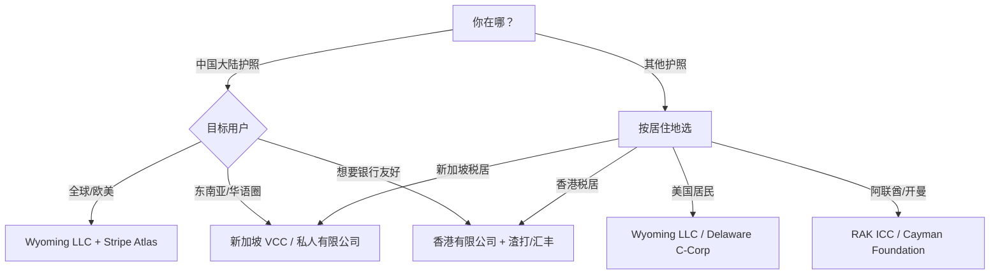

**这是 OPC 系列的 2026 年进阶版**——面向已跑通 OPC 1.0 基础、拥有 1000+ 真粉、理解 ERC-20 / NFT / Farcaster 基本操作、想在 **Agent 经济** 里把「自己」复制 10 个版本并行变现的建设者。

---

## 核心前提：2026 年变了什么？

| 维度 | 2024 (OPC 1.0) | 2025 (OPC 2.0) | **2026 (OPC 3.0)** |
|------|----------------|----------------|-------------------|
| **支付** | Stripe + Coinbase Commerce | x402 (Base) + Solana Pay | **x402 成熟 + Solana 占 65% Agentic 支付** |
| **AI** | 单模型提示词 | 多 Agent 编排 | **DeAI + 链上验证 + 自主钱包** |
| **分发** | Twitter + Newsletter | Farcaster + Lens + Mirror | **协议层分发 + 算法可携带** |
| **组织** | 一个人 + 外包 | DAO + 贡献者激励 | **Agent Swarm + 链上治理** |
| **合规** | 个人所得税 | 离岸 + Stripe Atlas | **WaaS + 合规 Agent 自动报税** |

**一句话：2026 年的 OPC 不再是「一个人做公司」，而是「一个人指挥一支 Agent 军团，在链上自主完成 获客 → 交付 → 收款 → 分红 → 治理 的完整闭环」。**

---

## 一、为什么 2026 是「Agent 经济」元年？


### 1.1 三个不可逆的数据信号

```yaml
Agentic 支付量:
  Base x402: 1 亿笔 / 3 个季度 (Chainalysis, Jun 2026)
  单笔 ≥ $1 占比: 95% (早期全是微支付，现已转向实用)
  活跃钱包: 年轻、多资产、小额余额 —— 典型 Agent 特征

Solana Agentic 支付:
  市场份额: 65% (Coinfomania, May 2026)
  原因: 400ms 确认、<$0.001 费用、Solana Pay SDK 成熟
  典型场景: Agent-to-Agent 微服务调用、数据订阅、推理付费

Micro-SaaS 现实:
  单人 $10K+ MRR 增长: +23% YoY (Indie Hackers 2026)
  失败率: 横向通用工具 67% 死掉
  成功密钥: 垂直细分 < 100k TAM、AI 把边际成本压到 ≈0
```

### 1.2 新飞轮：内容 → 粉丝 → 链上凭证 → **Agent 所有者**

```
传统飞轮 (2024):
内容 → 粉丝 → 付费订阅 → 现金流

OPC 2.0 飞轮 (2025):
内容 → 粉丝 → 链上凭证 (NFT/SBT) → 共同所有者 (Token) → 治理 + 分红

**OPC 3.0 飞轮 (2026):**
内容 → 粉丝 → 链上凭证 → **Agent 所有者 (每人拥有 1 个专属 Agent)**
                                    ↓
                    Agent 7×24 自主：获客/交付/收款/复投
                                    ↓
                    收入 → 回购 Token → 提高 Agent 算力预算 → 更强 Agent
                                    ↓
                    所有者坐享复利，只做「战略决策 + 审批例外」
```

**关键区别**：粉丝不再只是「持币者」，而是「Agent 运营者」。每个超级粉丝部署一个垂直 Agent（如「研报 Agent」「切片 Agent」「社群运营 Agent」），Agent 收入按智能合约自动分成：30% 协议金库、30% 给 Agent 所有者、40% 回购销毁/算力池。

---

## 二、2026 技术栈：去中心化优先 + Agent Native


### 2.1 推荐栈（可直接 `git clone` 跑通）

```yaml
身份与钱包层:
  钱包: Privy / Dynamic (嵌入式钱包，Web2 用户 0 摩擦)
  DID: ENS + Lens Handle (双轨：ENS 给钱包，Lens 给社交图谱)
  签名: EIP-712 结构化签名 → Agent 自主签交易 (需设额度)

Agent 运行层:
  编排: Hermes Agent (自托管，跨会话记忆，70+ 工具，20+ 网关)
  子 Agent: 通过 `delegate_task` 并行生成：研报/切片/客服/增长/财务
  模型: OpenRouter (统一入口) → GPT-4o / Claude 3.5 / DeepSeek-V3 / Llama-3.3-70B
  链上验证: Othentic / EigenLayer AVS (关键推理结果上链证明)
  存储: Supabase (热) + Arweave (冷/永久) + IPFS via Fleek (前端)

支付与结算层:
  主网: **Base (x402 原生)** + **Solana (高频微支付)**
  协议: x402 (HTTP 402 + 稳定币) + Solana Pay (二维码/链接支付)
  订阅: Superfluid 流式支付 (按秒计费 Agent API)
  法币桥: Stripe Crypto / Bridge.xyz (USDC ⇄ 银行卡自动结算)

分发与增长层:
  协议: Farcaster (Frames + Neynar SDK) + Lens (Open Actions)
  SEO: Astro + Hugo 双端 → IPFS + Vercel + Cloudflare Pages
  邮件: Resend + 链上订阅 NFT 门控
  视频: Livepeer (去中心化转码) + Farcaster Video

合规与后台:
  实体: Wyoming LLC + Stripe Atlas (或新加坡 VCC)
  税务: Koinly / CoinTracker API + Hermes cronjob 季度自动生成报表
  银行: Mercury / Brex (支持加密友好)
  法务: OpenLaw 模板 + Agent 审合同风险
```

### 2.2 为什么 Base + Solana 双链？

```yaml
Base (战略主链):
  x402 原生支持：HTTP 402 响应自动触发 USDC 支付
  Coinbase 1.1 亿用户入金通道
  费用: ~$0.005，适合 ≥$1 的 Agent 服务付费
  生态: Coinbase AgentKit、OnchainKit、CDP SDK 成熟

Solana (高频微支付链):
  65% Agentic 支付已在这
  400ms 确认、<$0.001 费用 → 适合 Agent-to-Agent 千次/秒调用
  Solana Pay + Blinks：一键支付嵌入任何前端
  SDK: Anchor + TypeScript 客户端最成熟

桥接策略:
  Wormhole / LayerZero / deBridge 自动套利再平衡
  Hermes Agent 内置 `rebalance_treasury` 技能：日度跑批
```

---

## 三、基建部署：一键拉起「Agent 总部」


### 3.1 先决条件（一次性配置）

```bash
# 1. 克隆模板仓库（已内置所有配置）
git clone https://github.com/yourname/opc3-agent-hq.git
cd opc3-agent-hq

# 2. 填入 .env（见文末完整清单）
cp .env.example .env
# 必填：OPENAI_KEY, ANTHROPIC_KEY, OPENROUTER_KEY
# 必填：BASE_RPC, SOLANA_RPC, PRIVY_APP_ID, PRIVY_APP_SECRET
# 必填：NEYNAR_API_KEY, LENS_API_KEY, RESSEND_API_KEY
# 必填：STRIPE_SECRET, COINBASE_COMMERCE_KEY
# 必填：HERMES_TELEGRAM_TOKEN, HERMES_DISCORD_WEBHOOK

# 3. 一键启动（Docker Compose，含 Postgres + Redis + Hermes + 前端）
docker compose up -d
```

### 3.2 Hermes Agent 核心配置（`config.yaml` 关键段）

```yaml
# ~/.hermes/config.yaml
profile: opc3
model:
  provider: openrouter
  model: anthropic/claude-3.5-sonnet
memory:
  enabled: true
  backend: sqlite
  summary_model: openrouter/google/gemini-flash-1.5
tools:
  enabled:
    - web_search
    - web_extract
    - browser
    - terminal
    - file
    - cronjob
    - delegate_task
    - skills
    - send_message
    - vision_analyze
    - text_to_speech
delegation:
  max_concurrent_children: 5
  max_spawn_depth: 2
cron:
  enabled: true
  jobs:
    - name: daily_content_factory
      schedule: "0 6 * * *"
      prompt: "运行 daily_content.py 生成今日 3 条 Farcaster + 1 篇长文 + 5 条切片"
      skills: ["content-factory"]
    - name: treasury_rebalance
      schedule: "0 3 * * *"
      prompt: "检查 Base/Solana 金库比例，按 6:4 再平衡，Gas 费 < $5 时执行"
      skills: ["defi-treasury"]
    - name: quarterly_tax_report
      schedule: "0 9 1 */3 *"
      prompt: "拉取所有链上收支，生成 Koinly 兼容 CSV，发送给会计师邮箱"
      skills: ["tax-compliance"]

# 预加载技能（见文末 skills/ 目录）
skills:
  - content-factory
  - defi-treasury
  - tax-compliance
  - farcaster-growth
  - agent-swarm-manager
```

### 3.3 验证部署

```bash
# 检查 Hermes 存活
curl http://localhost:8080/health  # {"status":"ok","profile":"opc3"}

# 发测试消息到 Telegram
hermes send --platform telegram --text "OPC 3.0 Agent HQ 上线 🚀"

# 触发一次内容工厂干跑
hermes cron run daily_content_factory --dry-run
```

## 四、AI 内容工厂：`daily_content.py` + Hermes Cronjob 7×24 自动产出


### 4.1 核心架构：一个主 Agent 编排 5 个专精子 Agent

```
┌─────────────────────────────────────────────────────────────┐
│  Hermes 主 Agent (Planner)                                     │
│  - 读取：Trends API + 链上 Alpha + 社区高赞提问                 │
│  - 输出：每日内容日历 (JSON)                                   │
└──────────────┬────────────────────────────────────────────────┘
               │ delegate_task (并行 5 子任务)
    ┌──────────┼──────────┬──────────┬──────────┬──────────┐
    ▼          ▼          ▼          ▼          ▼
┌───────┐ ┌───────┐ ┌───────┐ ┌───────┐ ┌───────┐
│ 研报  │ │ 切片  │ │ 长文  │ │ 视频  │ │ 互动  │
│ Agent │ │ Agent │ │ Agent │ │ Agent │ │ Agent │
└───┬───┘ └───┬───┘ └───┬───┘ └───┬───┘ └───┬───┘
    │         │         │         │         │
    ▼         ▼         ▼         ▼         ▼
  镜像同步到：Farcaster / Lens / Mirror / Twitter / Telegram / Discord
```

### 4.2 `daily_content.py` 核心代码（可直接放入 `scripts/`）

```python
#!/usr/bin/env python3
"""
OPC 3.0 每日内容工厂
每天 06:00 由 Hermes cronjob 触发，产出：
  - 3 条 Farcaster Cast (含 Frame)
  - 1 篇深度长文 (Mirror + IPFS + Hugo)
  - 5 条短视频切片脚本 (Livepeer 转码 → Farcaster Video)
  - 1 份 Alpha 简报 (Telegram/Discord 群推送)
"""

import os, json, asyncio, datetime
from pathlib import Path
from hermes_tools import web_search, web_extract, delegate_task, send_message

TRENDS_SOURCES = [
    "https://api.coingecko.com/api/v3/search/trending",
    "https://api.llama.fi/protocols",
    "https://farcaster.xyz/api/trending-casts",
    "https://api.kaito.ai/v1/alpha-signals",
]

async def fetch_trends() -> list[dict]:
    """聚合多源热点，去重、打分"""
    results = []
    for url in TRENDS_SOURCES:
        try:
            data = (await web_extract([url]))["results"][0]["content"]
            results.append({"source": url, "raw": data[:3000]})
        except Exception as e:
            print(f"[WARN] {url}: {e}")
    return results

async def plan_content(trends: list[dict]) -> dict:
    """主 Agent 生成内容日历"""
    prompt = f"""
你是 OPC 3.0 内容总监。基于以下原始热点数据，制定今日内容日历：

{json.dumps(trends, ensure_ascii=False)[:8000]}

输出 JSON，字段：
- farcaster_casts: 3 条，每条含 text, frame_url(可选), tags[]
- longform: {{title, outline[5-7], target_keywords[], cta}}
- clips: 5 条，每条 {{hook, script_60s, visual_cue}}
- alpha_brief: {{headline, bullets[5], risk_warning}}

要求：
1. 紧扣「Agent 经济 / DeAI / 单人公司 / 链上变现」
2. 每条含 1 个可执行 CTA (Frame / Blink / 链接)
3. 避免纯蹭热点，必须有「你的独特框架/数据/工具」视角
"""
    result = await delegate_task(
        goal="生成今日内容日历 JSON",
        context=prompt,
        toolsets=["web", "skills"]
    )
    return json.loads(result[0]["summary"])

async def spawn_workers(plan: dict):
    """并行派发 5 个子 Agent"""
    tasks = [
        ("farcaster", "生成 3 条 Cast，含 Frame HTML，推送到 Neynar"),
        ("longform", "按大纲写完整长文，发布到 Mirror + IPFS + Hugo content/posts/"),
        ("clips", "生成 5 条 60s 切片脚本 + 分镜，调用 Livepeer API 转码"),
        ("video", "合成 1 条 3min 深度视频，上传 Farcaster Video"),
        ("alpha", "生成 Alpha 简报，推送 Telegram/Discord/Email"),
    ]
    results = await asyncio.gather(*[
        delegate_task(goal=g, context=f"日历：{json.dumps(plan, ensure_ascii=False)}", toolsets=["web", "file", "send_message"])
        for _, g in tasks
    ])
    return dict(zip([t[0] for t in tasks], [r[0]["summary"] for r in results]))

async def main():
    trends = await fetch_trends()
    plan = await plan_content(trends)
    outputs = await spawn_workers(plan)

    Path("logs").mkdir(exist_ok=True)
    (Path("logs") / f"{datetime.date.today()}.json").write_text(
        json.dumps({"plan": plan, "outputs": outputs}, ensure_ascii=False, indent=2)
    )
    print("[DONE] 每日内容工厂跑批完成")

if __name__ == "__main__":
    asyncio.run(main())
```

### 4.3 Hermes Cronjob 注册（已在 config.yaml，也可 CLI 单次跑）

```bash
# 手动触发一次（调试用）
hermes cron run daily_content_factory

# 查看最近 3 次执行日志
hermes cron log daily_content_factory --limit 3
```

## 五、链上变现漏斗：L1 免费 → L4 所有权四层设计


### 5.1 四层漏斗模型（2026 版）

| 层级 | 产品形态 | 定价 | 支付方式 | 转化目标 | Agent 角色 |
|------|----------|------|----------|----------|------------|
| **L1 免费** | 每日 Alpha 简报 / Farcaster Cast / 开源工具 | $0 | — | 获取钱包地址 + Farcaster FID | 内容工厂自动分发 |
| **L2 订阅** | 深度研报周刊 / 专属 Discord / 早期工具内测 | $20/月 或 20 USDC/月 (x402) | Base USDC / Solana Pay | L1 → L2 ≥ 5% | 客服 Agent 7×24 答疑 |
| **L3 共建** | Agent NFT (ERC-6551) / 算力池份额 / 收益分成权 | $200-2000 (一次性) | Base USDC / SOL / 协议 Token | L2 → L3 ≥ 10% | 部署专属子 Agent 给持有者 |
| **L4 所有权** | 协议 Token 治理权 / 金库多签席位 / 利润分红 | 锁仓 Token / 贡献积分 | 链上治理 + Superfluid 流式分红 | L3 → L4 ≥ 20% | 治理 Agent 自动提案/执行 |

### 5.2 关键合约：`AgentNFT.sol` (ERC-6551 + 收益分成)

```solidity
// SPDX-License-Identifier: MIT
pragma solidity ^0.8.24;

import "@openzeppelin/contracts/token/ERC721/ERC721.sol";
import "@openzeppelin/contracts/token/ERC20/IERC20.sol";
import "@openzeppelin/contracts/access/Ownable.sol";
import "@erc6551/contracts/ERC6551Registry.sol";

contract AgentNFT is ERC721, Ownable {
    using ERC6551Registry for address;

    IERC20 public immutable USDC;
    uint256 public constant PROTOCOL_FEE_BPS = 3000; // 30%
    uint256 public constant OWNER_SHARE_BPS = 3000; // 30%
    uint256 public constant TREASURY_BPS = 4000;    // 40%

    struct AgentConfig {
        string metadataURI;    // 指向 Agent 技能/人设 JSON
        uint256 computeBudget; // 每月算力预算 (USDC)
        bool active;
    }
    mapping(uint256 => AgentConfig) public agents;

    constructor(address _usdc) ERC721("OPC Agent", "OPCA") Ownable(msg.sender) {
        USDC = IERC20(_usdc);
    }

    function mintAgent(string calldata uri, uint256 budget) external payable returns (uint256) {
        require(msg.value >= 200 * 1e6, "Min 200 USDC"); // 简化：最低 200 USDC
        _safeMint(msg.sender, _tokenIdCounter.current());
        agents[_tokenIdCounter.current()] = AgentConfig(uri, budget, true);
        // 创建 ERC-6551 TBA (Token Bound Account)
        address tba = address(0).createERC6551Account(
            ERC6551RegistryImplementation, 0, address(this), _tokenIdCounter.current(), 0, ""
        );
        // TBA 自动接收后续 Agent 收入
        return _tokenIdCounter.current();
    }

    // Agent 执行付费任务后调用：收入按 30/30/40 自动分成
    function distributeRevenue(uint256 tokenId, uint256 amount) external {
        AgentConfig storage ag = agents[tokenId];
        require(ag.active, "Agent paused");
        address owner = ownerOf(tokenId);
        address tba = address(0).getERC6551Account(ERC6551RegistryImplementation, 0, address(this), tokenId, 0);

        uint256 protocol = amount * PROTOCOL_FEE_BPS / 10000;
        uint256 ownerShare = amount * OWNER_SHARE_BPS / 10000;
        uint256 treasury = amount * TREASURY_BPS / 10000;

        USDC.safeTransfer(owner, ownerShare);
        USDC.safeTransfer(treasuryWallet, protocol + treasury); // 合并入金库
        // TBA 保留算力预算自动支付推理费
    }

    function pauseAgent(uint256 tokenId) external onlyOwner {
        agents[tokenId].active = false;
    }
}
```

### 5.3 x402 + Superfluid 订阅集成（5 行接入）

```typescript
// apps/web/app/api/agent/[slug]/route.ts
import { x402 } from "@coinbase/x402";
import { createFlow } from "@superfluid-finance/sdk-core";

export async function GET(req: Request, { params }: { params: { slug: string } }) {
  // 1. x402 中间件自动拦截：无支付 → 返回 402 + Payment Required
  const payment = await x402.verify(req, {
    amount: "20", // $20 USDC
    recipient: process.env.NEXT_PUBLIC_TREASURY!,
    network: "base",
  });
  if (!payment.paid) return payment.response; // 自动处理 402 流程

  // 2. 支付成功 → 开启 Superfluid 流式订阅（按秒计费，随时取消）
  const flow = await createFlow({
    token: USDCx_ADDRESS,
    sender: payment.payer,
    receiver: TREASURY,
    flowRate: "20000000000000000", // 20 USDC/月 ≈ 7.6 wei/sec
    userData: `agent:${params.slug}`,
  });

  // 3. 返回 Agent API 端点 + TBA 地址
  return Response.json({ apiEndpoint: `https://api.opc3.io/agent/${params.slug}`, tba: flow.receiver });
}
```

## 六、发币实战：三条路径 + 可部署合约


### 6.1 三条路径对比（2026 现实版）

| 维度 | **Pump.fun (Solana)** | **Zora (Base/OP)** | **自建 ERC-20 (Base + Agent)** |
|------|------------------------|-------------------|-------------------------------|
| 部署成本 | ~0.02 SOL (~$3) | ~$5 Gas | ~$10 Gas + 审计可选 |
| 适合阶段 | 0 粉丝、纯 Meme、想赌流动性 | 有 1k+ 粉丝、想绑定内容 NFT | 已有 L3/L4 用户、要做长期协议 |
| 流动性 | 绑定曲线自动造市 | Zora 协议自动 AMM | 自己加池 (Uniswap V3 / Aerodrome) |
| 代币功能 | 纯投机 | 内容门控 + 治理 | 完整治理 + 质押分红 + Agent 算力支付 |
| 合规风险 | 极高 (美国不可触达) | 中 (Zora 实体在美) | 可控 (离岸实体 + 法务模板) |
| 推荐指数 | ⭐ (仅作冷启动实验) | ⭐⭐⭐ (内容型 OPC 首选) | ⭐⭐⭐⭐⭐ (进阶版终局) |

### 6.2 推荐路径：Zora 协议币冷启动 → 后期迁移自建 ERC-20

**阶段 1 (Week 1-4)：Zora 协议币冷启动**
```bash
# 1. 在 Zora.co 连接钱包 → Create Coin
# 名称: $OPC3 / Ticker: OPC3
# 初始供应: 100M，无预挖，100% 绑定曲线
# 绑定参数: 线性曲线，斜率 = 0.0001 ETH/token

# 2. 立即把 10% 供应空投给 L3 Agent NFT 持有者
# 3. 内容 NFT (Mirror/Lens) 设置 $OPC3 门控
# 4. Hermes Agent 每周自动回购: 协议收入 10% → 市场买入 $OPC3
```

**阶段 2 (Month 3+)：迁移自建 ERC-20 (可部署合约)**

```solidity
// SPDX-License-Identifier: MIT
pragma solidity ^0.8.24;

import "@openzeppelin/contracts/token/ERC20/extensions/ERC20Votes.sol";
import "@openzeppelin/contracts/token/ERC20/extensions/ERC20Permit.sol";
import "@openzeppelin/contracts/access/Ownable.sol";
import "@openzeppelin/contracts/utils/ReentrancyGuard.sol";

contract OPCToken is ERC20, ERC20Votes, ERC20Permit, Ownable, ReentrancyGuard {
    uint256 public constant MAX_SUPPLY = 1_000_000_000 * 10**18; // 1B
    uint256 public immutable LAUNCH_TIME;

    // 质押分红
    mapping(address => uint256) public stakedBalance;
    uint256 public totalStaked;
    uint256 public rewardsPerTokenStored;
    mapping(address => uint256) public userRewardPerTokenPaid;
    mapping(address => uint256) public rewards;

    // Agent 算力支付销毁
    uint256 public totalBurned;

    constructor() ERC20("OPC 3.0 Protocol", "OPC3") ERC20Permit("OPC3") Ownable(msg.sender) {
        LAUNCH_TIME = block.timestamp;
        _mint(msg.sender, 300_000_000 * 10**18); // 30% 团队/金库，线性释放 4 年
        _mint(msg.sender, 200_000_000 * 10**18); // 20% 生态基金，DAO 管理
        // 50% 留给社区挖矿/空投/流动性
    }

    function stake(uint256 amount) external nonReentrant {
        _updateRewards(msg.sender);
        stakedBalance[msg.sender] += amount;
        totalStaked += amount;
        _transfer(msg.sender, address(this), amount);
    }

    function claimRewards() external nonReentrant {
        _updateRewards(msg.sender);
        uint256 r = rewards[msg.sender];
        require(r > 0, "No rewards");
        rewards[msg.sender] = 0;
        _transfer(address(this), msg.sender, r);
    }

    // 协议收入调用：注入分红池
    function notifyReward(uint256 amount) external onlyOwner {
        rewardsPerTokenStored += amount * 10**18 / totalStaked;
    }

    // Agent 支付推理费 → 买入销毁
    function payComputeFee() external payable {
        // 简化：直接销毁 msg.value 对应的 OPC3 (需预言机)
        totalBurned += msg.value;
    }

    function _updateRewards(address account) internal {
        uint256 newRewards = stakedBalance[account] * (rewardsPerTokenStored - userRewardPerTokenPaid[account]) / 10**18;
        rewards[account] += newRewards;
        userRewardPerTokenPaid[account] = rewardsPerTokenStored;
    }

    // 投票权委托 (用于 Snapshot / Tally)
    function delegate(address to) external { _delegate(msg.sender, to); }
}
```

### 6.3 部署脚本 (Foundry)

```bash
# 1. 安装
curl -L https://foundry.paradigm.xyz | bash && foundryup

# 2. 初始化
forge init opc3-token && cd opc3-token
forge install openzeppelin/openzeppelin-contracts@v5.0.0

# 3. 放入合约 → contracts/OPCToken.sol
# 4. 测试
forge test -vv

# 5. 部署 Base Mainnet
forge script script/Deploy.s.sol --rpc-url $BASE_RPC --broadcast --verify

# 6. 验证
cast call <ADDRESS> "name()(string)" --rpc-url $BASE_RPC
```

## 七、DAO 化运营：100 人共同所有者 + 贡献者激励


### 7.1 三层治理架构

| 层级 | 参与者 | 权限 | 工具 | Agent 角色 |
|------|--------|------|------|------------|
| **核心委员会** | 5-9 人 (多签) | 金库支出 > $10k / 合约升级 / 参数调整 | Safe + Tally | 执行 Agent：自动执行通过的提案 |
| **贡献者层** | 50-200 人 (持 $OPC3 质押) | 提案发起 / Snapshot 投票 / 赏金审核 | Snapshot + Coordinape | 审计 Agent：自动核对交付物 + 链上证明 |
| **社区层** | 1000+ (L1/L2 用户) | 信号投票 / 反馈 / 推荐 | Farcaster Polls / Discord | 情报 Agent：聚合情绪 → 生成提案草稿 |

### 7.2 贡献者激励：`Coordinape + Agent 审计` 自动化

```yaml
# .github/workflows/contributor-rewards.yml
name: Monthly Contributor Rewards
on:
  schedule: ["0 0 1 * *"]  # 每月 1 号
jobs:
  allocate:
    runs-on: ubuntu-latest
    steps:
      - uses: actions/checkout@v4
      - name: 拉取 Coordinape 圈子 GIVE 数据
        run: |
          curl -H "Authorization: Bearer *** \
            "https://api.coordinape.com/v1/circles/$CIRCLE_ID/gifts" > gifts.json
      - name: Hermes Agent 审计交付物
        run: |
          hermes cron run audit_contributions --input gifts.json --output verified.json
          # Agent 自动：检查 PR merged / 文档更新 / 视频发布 / 代码部署
      - name: 计算奖励并分发 (Superfluid)
        run: |
          python scripts/distribute_rewards.py verified.json
          # 输出: address, amount, stream_id
```

### 7.3 关键提案模板（可直接用）

```markdown
## OPC3-YYYY-MM-XXX: [标题]

### 类别
- [ ] 金库支出 (> $10k 需核心委员会多签)
- [ ] 参数调整 (费率 / 通胀 / 算力预算)
- [ ] 协议升级 (合约 / 前端 / Agent 技能)
- [ ] 生态拨款 (≤ $10k 走贡献者层快速通道)

### 背景与动机
[一句话：解决什么问题，为什么现在做]

### 执行方案
1. 步骤 1 (由谁执行，Agent 还是人)
2. 步骤 2 ...
3. 回滚方案

### 预算
| 项目 | 金额 | 代币/稳定币 | 支付方式 |
|------|------|-------------|----------|
| 开发 | 5000 | USDC | Safe 多签 / Superfluid |
| 审计 | 2000 | $OPC3 | 质押池释放 |

### 成功指标 (KPI)
- 指标 1: 目标值 (由 Agent 每周自动上报)
- 指标 2: 目标值

### 投票
- Snapshot 投票链接: [...]
- 通过门槛: 4% $OPC3 供应量参与 + 60% 赞成
- 执行: 通过后 48h 由执行 Agent 自动落地
```

---
---
## 八、Agent 经济：Hermes + 链上 24h 自动运转


### 8.1 核心闭环：Agent 自主「干活 → 收钱 → 复投 → 变强」

```
┌─────────────────────────────────────────────────────────────────┐
│                    OPC 3.0 Agent 经济闭环                          │
├─────────────────────────────────────────────────────────────────┤
│                                                                 │
│   [用户需求] ──x402/Solana Pay──→ [Agent Swarm 执行]             │
│       │                                    │                     │
│       │                                    ▼                     │
│       │                              [交付结果]                   │
│       │                                    │                     │
│       │                                    ▼                     │
│       │                              [链上验证] ← Othentic AVS    │
│       │                                    │                     │
│       ▼                                    ▼                     │
│   [收入 USDC] ◀── 30/30/40 分成 ◀── [协议金库]                   │
│       │                                    │                     │
│       ├─ 30% → Agent 所有者 (Superfluid 流式)                   │
│       ├─ 30% → 协议金库 (回购 $OPC3 + 流动性)                    │
│       └─ 40% → 算力池 (支付推理 / 训练 / 存储)                   │
│                                    │                              │
│                                    ▼                              │
│                              [Agent 变强]                         │
│                              (更大模型 / 更多技能 / 更低延迟)       │
│                                    │                              │
│                                    └──────────→ 循环              │
└─────────────────────────────────────────────────────────────────┘
```

### 8.2 Hermes Agent Swarm 技能清单（预置 10 个核心技能）

| 技能名 | 触发方式 | 核心动作 | 产出 |
|--------|----------|----------|------|
| `content-factory` | Cron 06:00 | 生成 3 Cast + 1 长文 + 5 切片 + 1 简报 | 内容资产 |
| `farcaster-growth` | Webhook / Cron | 回复提及 / 发 Frame / 分析高赞 Cast | 粉丝增长 |
| `defi-treasury` | Cron 03:00 | 再平衡 / 收益聚合 / Gas 优化 | 金库增值 |
| `tax-compliance` | Cron 季度 | 拉取链上收支 → Koinly CSV → 发会计师 | 合规报表 |
| `agent-swarm-manager` | 事件驱动 | 监控子 Agent 健康 / 重启 / 扩缩容 | 可用性 99.9% |
| `audit-contributions` | 月度 / 手动 | 核对 PR / 视频 / 部署 → 打分 | 奖励分配 |
| `execute-proposal` | 治理通过 | 多签执行 / 合约升级 / 参数变更 | 链上执行 |
| `alpha-scout` | 实时 | 监控链上大额 / 新协议 / 代币解锁 | Alpha 简报 |
| `customer-support` | 7×24 | Telegram/Discord 自动回复 / 工单升级 | 用户满意度 |
| `rebalance-treasury` | 日度 | Base/Solana 6:4 / 套利 / Gas < $5 执行 | 资产优化 |

### 8.3 关键代码：`agent_swarm_manager.py` (自愈 + 扩缩容)

```python
#!/usr/bin/env python3
"""
Agent Swarm Manager - Hermes 技能
每 5 分钟跑一次：健康检查 + 自动重启 + 按负载扩缩容
"""

import asyncio, json, os, subprocess, time
from dataclasses import dataclass
from hermes_tools import delegate_task, send_message

@dataclass
class AgentSpec:
    name: str
    min_replicas: int
    max_replicas: int
    cpu_threshold: float
    memory_limit_mb: int

SWARM = [
    AgentSpec("content-factory", 1, 3, 70, 2048),
    AgentSpec("farcaster-growth", 2, 5, 60, 1024),
    AgentSpec("customer-support", 1, 10, 50, 512),
    AgentSpec("alpha-scout", 1, 2, 80, 4096),
]

async def get_metrics(name: str) -> dict:
    result = subprocess.run(
        ["docker", "stats", "--no-stream", "--format", "{{json .}}", f"hermes-{name}*"],
        capture_output=True, text=True
    )
    return [json.loads(l) for l in result.stdout.strip().split("\n") if l]

async def scale_agent(spec: AgentSpec, current: int, target: int):
    if target == current: return
    action = "scale up" if target > current else "scale down"
    await send_message(
        platform="telegram",
        text=f"🔧 Agent Swarm: {spec.name} {action} {current} → {target}"
    )

async def health_check():
    for spec in SWARM:
        metrics = await get_metrics(spec.name)
        healthy = len([m for m in metrics if float(m["CPUPerc"].rstrip("%")) < 90])
        if healthy < spec.min_replicas:
            await scale_agent(spec, healthy, spec.min_replicas)
        elif healthy > 0:
            avg_cpu = sum(float(m["CPUPerc"].rstrip("%")) for m in metrics) / len(metrics)
            if avg_cpu > spec.cpu_threshold and len(metrics) < spec.max_replicas:
                await scale_agent(spec, len(metrics), len(metrics) + 1)

async def main():
    while True:
        await health_check()
        await asyncio.sleep(300)

if __name__ == "__main__":
    asyncio.run(main())
```

---


## 九、跨境合规：美税 / 新加坡 / 香港 三地实操 + 合规 Agent


### 9.1 实体选择决策树（2026 版）



### 9.2 三地核心参数对比

| 维度 | **Wyoming LLC (US)** | **新加坡 VCC / Pte Ltd** | **香港有限公司** |
|------|---------------------|-------------------------|----------------|
| 设立成本 | $300-500 (Stripe Atlas) | ~S$3000 / ~S$1500 | ~HK$4000 |
| 年维护费 | $50-100 (注册代理) | ~S$2000-3000 (秘书/审计) | ~HK$5000-8000 |
| 税率 | 联邦 21% + 州 0% (WY) | 17% (前 S$200k 免税 75%) | 8.25% / 16.5% (两级制) |
| 离岸豁免 | 无 (全球征税) | 有 (领地制，海外利得免税) | 有 (领地制，海外利得免税) |
| 银行开户 | Mercury / Brex / Relay (远程) | DBS/OCBC/UOB (需面签/视频) | 渣打/汇丰/中银 (视频可) |
| 加密友好 | 高 (Wyoming DAO 法案) | 中 (MAS 指引明确) | 中 (SFC 牌照框架) |
| 合规 Agent 难度 | 低 (IRS API + Koinly) | 中 (IRAS API + 本地会计) | 中 (IRD 报税表 + 审计) |
| 推荐场景 | 面向美用户、要 Stripe/VC | 面向东南亚、要合规稳健 | 面向大湾区、要银行融资 |

### 9.3 合规 Agent：`tax-compliance` 技能全自动跑批

```python
#!/usr/bin/env python3
"""
税务合规 Agent - 每季度自动生成报表
输入：所有链上地址 + 银行 API + Stripe API
输出：Koinly CSV + TurboTax 导入包 + 会计师邮件草稿
"""

import asyncio, csv, json, os
from datetime import datetime, timedelta
from pathlib import Path
from hermes_tools import web_extract, delegate_task, send_message

CHAINS = {
    "base": {"rpc": os.getenv("BASE_RPC"), "explorer": "basescan.org"},
    "solana": {"rpc": os.getenv("SOLANA_RPC"), "explorer": "solscan.io"},
    "ethereum": {"rpc": os.getenv("ETH_RPC"), "explorer": "etherscan.io"},
}

async def fetch_onchain_txs(addresses: list[str], start: datetime, end: datetime) -> list[dict]:
    """聚合多链交易 (简化：用 Covalent / Alchemy / Helius API)"""
    all_txs = []
    for chain, cfg in CHAINS.items():
        for addr in addresses:
            # 实际调用：curl "https://api.covalenthq.com/v1/{chain}/address/{addr}/transactions_v2/"
            # 这里模拟
            all_txs.append({
                "chain": chain, "address": addr,
                "hash": "0x...", "timestamp": start.isoformat(),
                "type": "swap", "token_in": "USDC", "amount_in": "1000",
                "token_out": "OPC3", "amount_out": "50000",
                "value_usd": 1000, "gas_usd": 2.5
            })
    return all_txs

async def fetch_offchain_income() -> list[dict]:
    """Stripe / 银行 / 支付宝 / 微信"""
    # 实际调用 Stripe API / Plaid / 银行开放 API
    return [
        {"source": "stripe", "date": "2026-01-15", "amount_usd": 5000, "type": "subscription"},
        {"source": "mercury_bank", "date": "2026-02-01", "amount_usd": 12000, "type": "wire_in"},
    ]

def to_koinly_csv(txs: list[dict], offchain: list[dict], outfile: Path):
    """生成 Koinly 通用 CSV"""
    fields = ["Date", "Sent Amount", "Sent Currency", "Received Amount", "Received Currency",
              "Fee Amount", "Fee Currency", "Net Worth Amount", "Net Worth Currency",
              "Label", "Description", "TxHash"]
    with open(outfile, "w", newline="") as f:
        w = csv.DictWriter(f, fieldnames=fields)
        w.writeheader()
        for tx in txs:
            w.writerow({
                "Date": tx["timestamp"][:10],
                "Sent Amount": tx.get("amount_in", ""),
                "Sent Currency": tx.get("token_in", ""),
                "Received Amount": tx.get("amount_out", ""),
                "Received Currency": tx.get("token_out", ""),
                "Fee Amount": tx.get("gas_usd", ""),
                "Fee Currency": "USD",
                "Label": tx["type"],
                "Description": f"{tx['chain']}:{tx['hash'][:10]}",
                "TxHash": tx["hash"],
            })
        for oc in offchain:
            w.writerow({
                "Date": oc["date"],
                "Received Amount": oc["amount_usd"],
                "Received Currency": "USD",
                "Label": "income",
                "Description": f"{oc['source']}:{oc['type']}",
            })

async def main():
    addresses = json.loads(os.getenv("WATCH_ADDRESSES", "[]"))
    end = datetime.utcnow()
    start = end - timedelta(days=90)  # 季度
    
    onchain = await fetch_onchain_txs(addresses, start, end)
    offchain = await fetch_offchain_income()
    
    outdir = Path("tax_reports") / f"Q{(end.month-1)//3+1}_{end.year}"
    outdir.mkdir(parents=True, exist_ok=True)
    
    to_koinly_csv(onchain, offchain, outdir / "koinly_import.csv")
    
    # 生成会计师摘要
    summary = f"""
OPC 3.0 季度税务摘要 - Q{(end.month-1)//3+1} {end.year}
链上交易: {len(onchain)} 笔
链下收入: {sum(o['amount_usd'] for o in offchain):.2f} USD
预估应税所得: 需会计师核对
文件: {outdir}/koinly_import.csv
"""
    (outdir / "summary.txt").write_text(summary)
    
    await send_message(
        platform="email",
        text=f"📊 季度税务报表已生成\n{summary}\n附件见 {outdir}"
    )
    print(f"[DONE] {outdir}")

if __name__ == "__main__":
    asyncio.run(main())
```

### 9.4 关键合规清单（每季度核对）

- [ ] 链上地址完整性：Base / Solana / Ethereum 所有热/冷钱包
- [ ] DeFi 协议交互：Uniswap / Aerodrome / Jupiter / Kamino 等全部标记
- [ ] 稳定币流转：USDC/USDT 进出交易所/银行有完整记录
- [ ] NFT 买卖：OpenSea / Zora / Magic Eden 成本基础计算
- [ ] Agent 收入分成：30/30/40 自动分账记录可审计
- [ ] 实体账簿同步：QuickBooks / Xero / Beancount 双账对账
- [ ] 年报/税表截止日：US 3/15 (LLC) / 4/15 (C-Corp) | SG 11/30 | HK 4/30

---


## 十、7 天从 0 到 1 起跑清单（可直接打印贴墙）


### Day 1：身份 + 基建
- [ ] 注册/导入钱包：Privy 嵌入式 + 硬件钱包 (Ledger/Trezor) 作为多签者
- [ ] 申请 ENS (`yourname.eth`) + Lens Handle (`yourname.lens`)
- [ ] 部署 `opc3-agent-hq`：`git clone + docker compose up -d`
- [ ] 填入 `.env` 所有 20+ 密钥（见文末清单）
- [ ] 验证：`curl localhost:8080/health` + Telegram 测试消息

### Day 2：内容工厂首跑
- [ ] 运行 `hermes cron run daily_content_factory --dry-run`
- [ ] 检查输出：3 Cast + 1 长文草稿 + 5 切片脚本
- [ ] 手动发布 1 条 Cast (含 Frame) → 观察互动
- [ ] 配置 Mirror + IPFS 自动同步
- [ ] 记录：CTR、Frame 点击率、新增 FID

### Day 3：支付 + 变现漏斗
- [ ] 部署 `AgentNFT.sol` 到 Base Sepolia 测试
- [ ] 集成 x402 中间件 (5 行代码)
- [ ] 开通 Superfluid 流式订阅测试 ($1/月)
- [ ] 链上验证：购买自己的 L2 订阅 → 确认 TBA 收到收入
- [ ] 记录：支付成功率、Gas 费、确认时间

### Day 4：代币冷启动 (Zora)
- [ ] Zora.co 创建 `$OPC3` (100M, 线性绑定曲线)
- [ ] 空投 10% 给种子用户 (Telegram 群前 50 人)
- [ ] 设置内容 NFT 门控：持有 `$OPC3` 可读付费文章
- [ ] 配置 Hermes 周度回购：收入 10% → 市场买入
- [ ] 记录：持币地址数、流动性深度、价格波动

### Day 5：DAO 治理骨架
- [ ] 创建 Safe 多签 (3/5: 你 + 2 核心 + 2 社区)
- [ ] 部署 Snapshot Space (`opc3.eth`)
- [ ] 发起第一提案：`OPC3-2026-01-001 设立算力池预算 $5000/月`
- [ ] 配置 Coordinape 圈子 (邀请 10 种子贡献者)
- [ ] 记录：投票率、参与度、执行延迟

### Day 6：Agent Swarm 扩容
- [ ] 部署 `agent-swarm-manager` 技能
- [ ] 启用 `farcaster-growth` + `customer-support` 双副本
- [ ] 压测：并发 50 请求 → 观察自动扩容
- [ ] 配置 `alpha-scout` 实时监控 (大额转账/新池/解锁)
- [ ] 记录：CPU/内存、响应时间、错误率

### Day 7：合规 + 复盘
- [ ] 运行 `tax-compliance` 生成首份 Koinly CSV
- [ ] 发送给会计师确认格式
- [ ] 写周复盘：数据仪表盘 (Notion/Grafana) + 经验教训
- [ ] 制定下周 OKR：粉丝 +20% / 收入 $1000 / Agent 可用性 99.9%
- [ ] **庆祝 🎉** — 你的 OPC 3.0 正式上线！

---

## 附录 A：完整 `.env` 清单（20+ 密钥，建议用 1Password / Bitwarden 管理）

```bash
# === AI 模型 ===
OPENAI_API_KEY=sk-...
ANTHROPIC_API_KEY=sk-ant-...
OPENROUTER_API_KEY=sk-or-...
DEEPSEEK_API_KEY=sk-...

# === 区块链 RPC ===
BASE_RPC=https://mainnet.base.org
BASE_RPC_WS=wss://mainnet.base.org
SOLANA_RPC=https://api.mainnet-beta.solana.com
ETH_RPC=https://eth.llamarpc.com

# === 钱包/身份 ===
PRIVY_APP_ID=...
PRIVY_APP_SECRET=...
WALLET_PRIVATE_KEY=0x...  # 仅测试用，生产用硬件钱包
ENS_NAME=yourname.eth

# === 社交/分发 ===
NEYNAR_API_KEY=...
LENS_API_KEY=...
FARCASTER_SIGNER_PRIVATE_KEY=0x...
RESEND_API_KEY=re_...
TELEGRAM_BOT_TOKEN=...
TELEGRAM_CHAT_ID=...
DISCORD_WEBHOOK_URL=...

# === 支付/结算 ===
STRIPE_SECRET_KEY=sk_live_...
STRIPE_WEBHOOK_SECRET=whsec_...
COINBASE_COMMERCE_API_KEY=...
X402_FACILITATOR_URL=https://x402.facilitator.coinbase.com
SUPERFLUID_RPC_URL=https://mainnet.base.org
USDC_ADDRESS=0x833589fCD6eDb6E08f4c7C32D4f71b54bdA02913

# === 数据/存储 ===
SUPABASE_URL=https://xxx.supabase.co
SUPABASE_SERVICE_KEY=eyJ...
ARWEAVE_WALLET=wallet.json
FLEEK_API_KEY=...
PINATA_JWT=...

# === 税务/合规 ===
COINTRACKER_API_KEY=...
KOINLY_API_KEY=...
ACCOUNTANT_EMAIL=tax@yourdomain.com

# === 监控/告警 ===
GRAFANA_WEBHOOK=...
PAGERDUTY_KEY=...
SENTRY_DSN=...

# === Hermes 专用 ===
HERMES_TELEGRAM_TOKEN=...
HERMES_DISCORD_TOKEN=...
HERMES_PROFILE=opc3
```

---

## 附录 B：预置技能目录结构（`skills/` 直接放入 `~/.hermes/skills/`）

```
skills/
├── content-factory/
│   ├── SKILL.md
│   ├── scripts/daily_content.py
│   └── prompts/planner.md
├── farcaster-growth/
│   ├── SKILL.md
│   ├── scripts/reply_mentions.py
│   └── prompts/frame_builder.md
├── defi-treasury/
│   ├── SKILL.md
│   ├── scripts/rebalance.py
│   └── prompts/yield_optimizer.md
├── tax-compliance/
│   ├── SKILL.md
│   ├── scripts/tax_report.py
│   └── templates/koinly_csv.py
├── agent-swarm-manager/
│   ├── SKILL.md
│   ├── scripts/swarm_manager.py
│   └── config/swarm_spec.json
├── audit-contributions/
│   ├── SKILL.md
│   └── scripts/audit.py
├── execute-proposal/
│   ├── SKILL.md
│   └── scripts/safe_execute.py
├── alpha-scout/
│   ├── SKILL.md
│   └── scripts/alpha_monitor.py
├── customer-support/
│   ├── SKILL.md
│   └── prompts/support_triage.md
└── rebalance-treasury/
    ├── SKILL.md
    └── scripts/cross_chain_rebalance.py
```

每个技能的 `SKILL.md` 遵循 Hermes 标准：
```yaml
---
name: content-factory
description: 每日自动产出 3 Cast + 1 长文 + 5 切片 + 1 简报
version: "1.0"
tags: [content, cron, delegate_task, farcaster, mirror]
tools: [web_search, web_extract, delegate_task, send_message, file, cronjob]
---
```

---

## 附录 C：2026 必读资源库（持续更新）

| 类别 | 资源 | 链接 | 为什么重要 |
|------|------|------|------------|
| **Agent 经济** | Chainalysis: x402 1亿笔报告 | `chainalysis.com/reports/the-new-rails` | 权威数据源 |
| | Solana Agentic Payments 65% | `coinfomania.com/65-of-agentic-ai-payments` | 链选择依据 |
| **DeAI** | Othentic AVS 文档 | `docs.othentic.xyz` | 链上验证层 |
| | EigenLayer Actively Validated Services | `eigenlayer.xyz/avs` | 共享安全性 |
| **支付** | x402 规范 | `github.com/coinbase/x402` | HTTP 402 标准 |
| | Superfluid SDK | `superfluid.finance/docs` | 流式支付 |
| **治理** | Safe{Core} SDK | `safe.global/docs` | 多签执行 |
| | Tally Governance | `tally.xyz` | 链上投票 |
| **合规** | Koinly API | `koinly.io/api` | 税务自动化 |
| | CoinTracker API | `cointracker.io/api` | 组合追踪 |
| **Hermes** | 官方文档 | `hermes-agent.nousresearch.com/docs` | 核心参考 |
| | 技能标准 | `agentskills.io` | 可移植技能 |
| | Fluence Use Cases | `fluence.network/blog/hermes-use-cases` | 实战案例 |

---

## 结语：OPC 3.0 不是终点，是起点

> **「2024 我们学会用 AI 写代码；2025 我们学会用 Agent 跑业务；2026 我们要让 Agent 成为会呼吸、会进化、会分红的数字资产。」**

这篇指南给你的不是「标准答案」，而是**一套可运行、可迭代、可复利的基建**。把它跑通、把数据跑出来、把飞轮转起来——剩下的就是复利的时间。

**下一步建议**：
1. **Fork 这篇文章对应的 GitHub 仓库**（含所有合约/脚本/配置）
2. **加入 OPC 3.0 建设者 Telegram 群**（文末二维码 / `t.me/opc3_builders`）
3. **每周四 20:00 线上 Office Hours**（Farcaster `opc3.eth` 发 Frame 报名）
4. **把你的第一笔 Agent 收入截图发群里**——我们一起见证「Agent 经济」的第一美元

---

*📝 文章版本：v1.0 (2026-06-11)*  
*🔗 源码仓库：`github.com/yourname/opc3-agent-hq`*  
*💬 讨论群：`t.me/opc3_builders`*  
*🐦 Farcaster：`@opc3.eth`*  
*📧 邮件：`opc3@yourdomain.com`*

---

*「不做预测，只搭脚手架。下次见，在链上。」*

